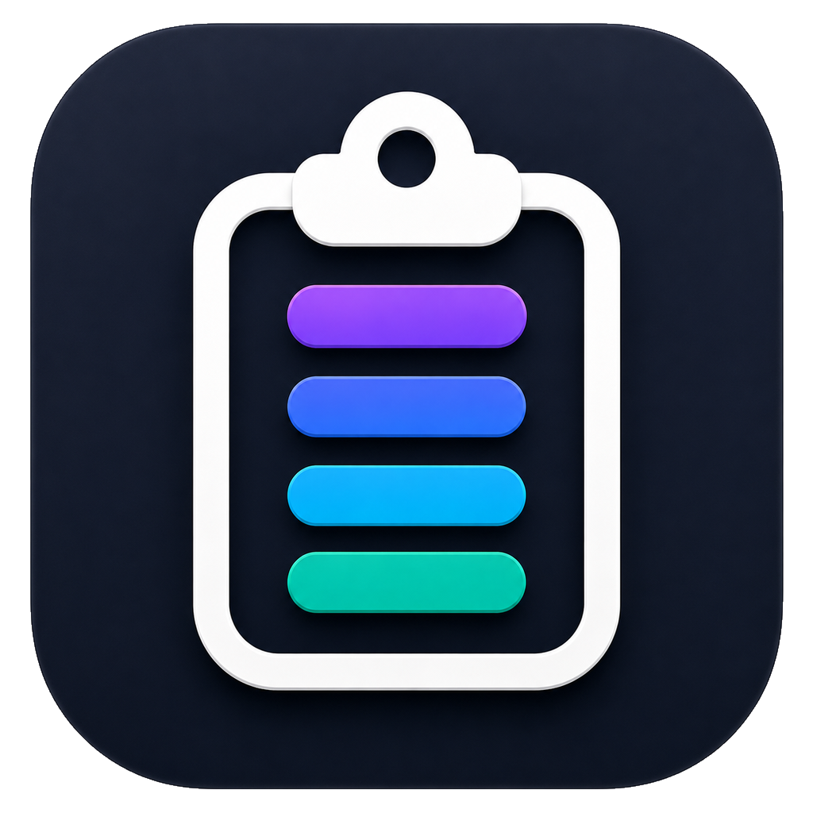

# Cliptory

  

<strong>Win+V-style clipboard history, designed natively for macOS.</strong>

  Search copied text, images, files, and screenshot text—then paste it back without breaking focus.

> **Portfolio showcase:** this public repository contains product visuals and a read-only case study. Source code, build files, binaries, packages, and installation instructions are intentionally private while Cliptory is prepared for commercial release.

## App in Use

These screens show the product in its primary loop: open the history from the menu bar, search across mixed clipboard content, find text inside a copied screenshot, then tune privacy and paste behavior in Settings.

| History search | Screenshot OCR |
| --- | --- |
|  |  |

| Privacy settings | Feature overview |
| --- | --- |
|  |  |

## Product Snapshot

| | |
| --- | --- |
| **Platform** | macOS menu-bar app |
| **Interface** | Native AppKit |
| **Primary workflow** | Open with a global shortcut, search, select, paste |
| **Clipboard types** | Text, rich text, images, and files |
| **Privacy model** | Local by default, encrypted at rest, no analytics |
| **Optional sync** | Pinned items and collections only |

## The Product

Cliptory solves a small, frequent interruption: losing something that was copied a few minutes ago. A configurable global shortcut opens either a compact menu-bar panel or a full history window. From there, the experience is keyboard-first—search, preview, pin, transform, queue, or paste an item in a few keystrokes.

### Fast retrieval

- Exact or fuzzy search across clipboard history.
- Command-number quick selection and Return-to-paste workflow.
- Full previews for copied text, images, and file entries.
- Pinned snippets, named collections, and optional global shortcuts per snippet.

### Flexible paste workflows

- Rich-text, plain-text, or transformed-text paste.
- Quick transforms for case changes, trimming, URL decoding, and JSON formatting.
- Paste queue for collecting several items and pasting them in sequence.
- Per-app rules for ignored apps, plain-text targets, and automatic forgetting.

## On-Device AI/OCR

When a screenshot reaches the clipboard, Cliptory can use Apple Vision to recognize its text and add that text to the local search index. Screenshot content becomes searchable without uploading clipboard data to an external OCR service.

## Privacy by Design

Clipboard history can contain passwords, private messages, customer data, and temporary codes, so privacy is part of the product architecture rather than a secondary setting.

- History is stored locally and encrypted at rest with a Keychain-backed key.
- Concealed and transient clipboard entries can be filtered automatically.
- Universal Clipboard content can be excluded.
- There is no analytics or developer-operated data service.
- Optional iCloud sync is limited to pinned items and collections; everyday history remains local.

## Engineering Highlights

- Native AppKit menu-bar behavior, global hotkeys, compact and full-window modes.
- Clipboard monitoring for text, rich text, images, files, source-app metadata, and transient content.
- Local persistence covering history, encrypted image blobs, pins, collections, and preferences.
- Keyboard-first interaction across selection, preview, deletion, pinning, queueing, and paste behavior.
- Shortcuts.app actions for retrieving the latest item and searching clipboard history.
- Optional CloudKit path deliberately scoped to user-pinned content.

## Repository Boundary

This repository is provided for portfolio and product-review purposes only. It includes screenshots, product notes, and branding assets. It does **not** include implementation code, project files, scripts, dependencies, app binaries, archives, or distributable builds.

See [NOTICE.md](NOTICE.md) for asset usage restrictions.
