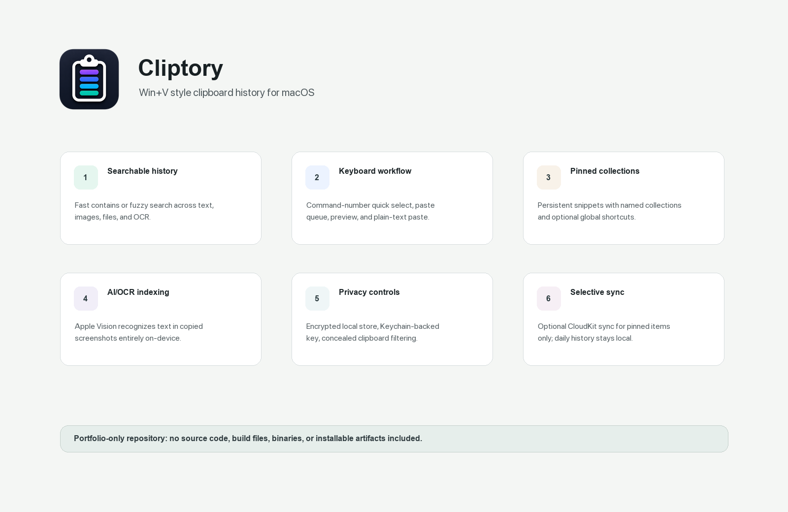
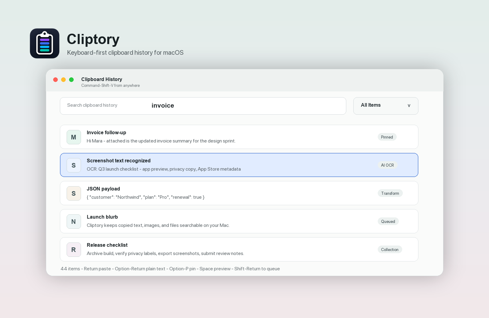
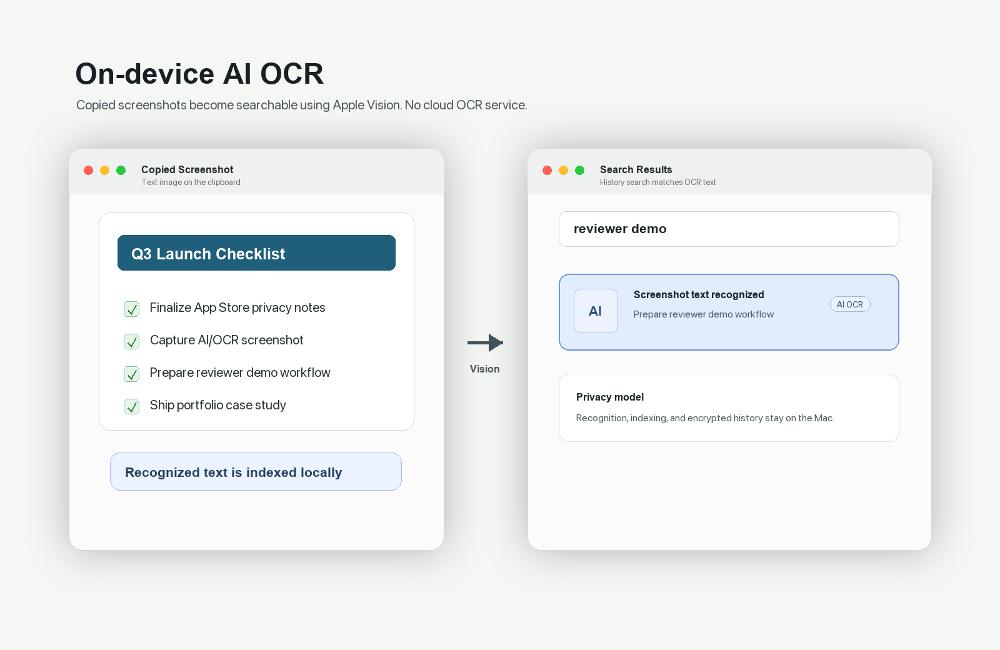
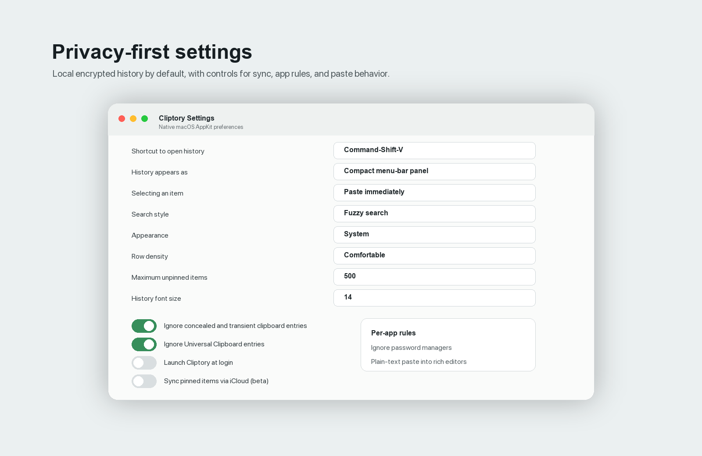

# Cliptory

**Win+V style clipboard history for macOS.**

Cliptory is a native macOS clipboard manager I built to make copied text, images, files, and screenshot text easy to search and paste again. This repository is a public portfolio showcase only: it intentionally does not include source code, build files, app binaries, package archives, or installation instructions.

> Source code and distributable builds are private while Cliptory is being prepared for commercial release.

## Screenshots

## What It Does

- Captures clipboard history in a native AppKit menu-bar app.
- Provides compact popup and full-window history views.
- Searches clipboard history with exact or fuzzy matching.
- Supports pinned snippets, named collections, and per-snippet global shortcuts.
- Lets users paste as rich text, plain text, transformed text, or a queued batch.
- Previews full copied text, images, and file clipboard entries.
- Uses Apple's on-device Vision OCR so copied screenshots become searchable.
- Stores history locally with encryption at rest and a Keychain-backed key.
- Filters concealed/transient clipboard entries and optional Universal Clipboard content.
- Adds per-app rules for ignored apps, plain-text paste targets, and auto-forget workflows.
- Provides optional iCloud sync for pinned items and collections only.
- Exposes Shortcuts.app actions for retrieving and searching clipboard history.

## AI/OCR Highlight

The AI-facing feature is privacy-preserving OCR for copied screenshots. When an image lands on the clipboard, Cliptory can run Apple's on-device Vision text recognition, fold the recognized text into the item's search index, and keep the result local to the Mac. This makes screenshot content searchable without sending clipboard data to an external service.

## Engineering Highlights

- Native macOS AppKit UI with menu-bar behavior and global hotkeys.
- Local persistence layer for text, rich text, images, files, pins, collections, and user preferences.
- Encryption-at-rest design using a key stored in the macOS Keychain.
- Clipboard monitoring with handling for concealed entries, transient entries, Universal Clipboard, and source-app metadata.
- Keyboard-first UX for quick selection, paste queue management, preview, delete, pinning, and plain-text paste.
- Optional CloudKit path scoped to pinned items and collections, not everyday clipboard history.
- Shortcuts integration for automation-friendly access to latest and searched clipboard items.

## Repository Policy

This public repository is for portfolio review only. It contains screenshots, product notes, and branding assets; it does not contain Cliptory's implementation, installable artifacts, or distributable builds.

See [NOTICE.md](NOTICE.md) for usage restrictions on the assets in this showcase.
